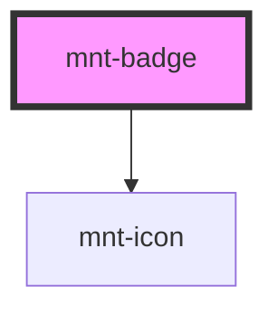

# mnt-badge

<!-- Auto Generated Below -->

## Properties

| Property | Attribute | Description | Type                                                                            | Default     |
| -------- | --------- | ----------- | ------------------------------------------------------------------------------- | ----------- |
| `color`  | `color`   |             | `"critical" \| "neutral" \| "primary" \| "secondary" \| "success" \| "warning"` | `'primary'` |
| `icon`   | `icon`    |             | `string`                                                                        | `undefined` |
| `label`  | `label`   |             | `string`                                                                        | `undefined` |
| `size`   | `size`    |             | `"large" \| "medium" \| "small" \| "tiny"`                                      | `'medium'`  |
| `tone`   | `tone`    |             | `"default" \| "emphasis" \| "highlight"`                                        | `'default'` |

## Dependencies

### Depends on

- [mnt-icon](../icon)

### Graph

----------------------------------------------

*Built with [StencilJS](https://stenciljs.com/)*
