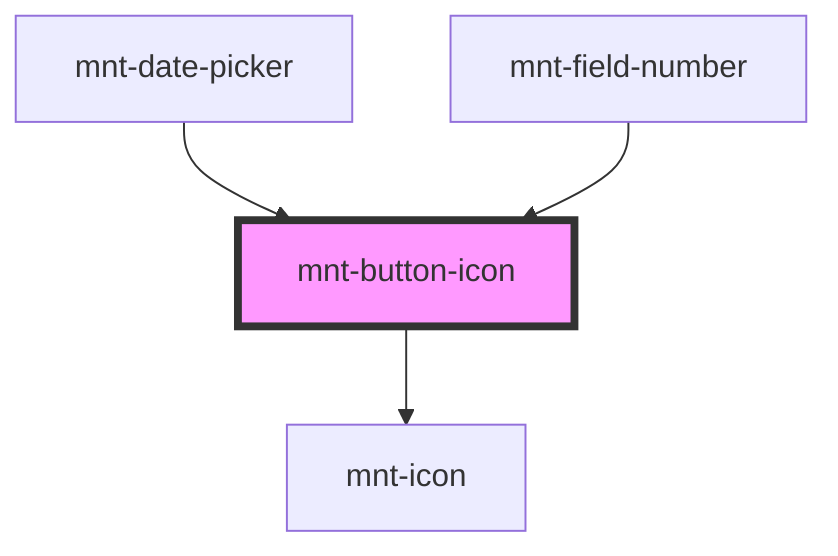

# mnt-button-icon

<!-- Auto Generated Below -->

## Properties

| Property   | Attribute  | Description | Type                                                                            | Default     |
| ---------- | ---------- | ----------- | ------------------------------------------------------------------------------- | ----------- |
| `color`    | `color`    |             | `"critical" \| "neutral" \| "primary" \| "secondary" \| "success" \| "warning"` | `'primary'` |
| `disabled` | `disabled` |             | `boolean`                                                                       | `false`     |
| `icon`     | `icon`     |             | `string`                                                                        | `undefined` |
| `size`     | `size`     |             | `"large" \| "medium" \| "small" \| "tiny"`                                      | `'medium'`  |
| `variant`  | `variant`  |             | `"emphasis" \| "plain" \| "regular" \| "stroke"`                                | `'regular'` |

## Events

| Event         | Description | Type                      |
| ------------- | ----------- | ------------------------- |
| `buttonClick` |             | `CustomEvent<MouseEvent>` |

## Shadow Parts

| Part       | Description |
| ---------- | ----------- |
| `"button"` |             |

## Dependencies

### Used by

 - [mnt-date-picker](../date-picker)
 - [mnt-field-number](../field-number)

### Depends on

- [mnt-icon](../icon)

### Graph

----------------------------------------------

*Built with [StencilJS](https://stenciljs.com/)*
