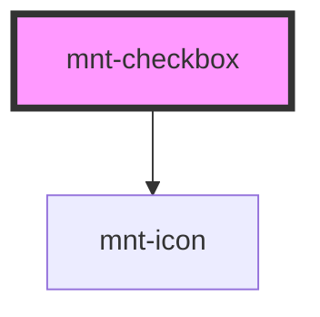

# mnt-checkbox

<!-- Auto Generated Below -->

## Properties

| Property  | Attribute | Description | Type                         | Default     |
| --------- | --------- | ----------- | ---------------------------- | ----------- |
| `label`   | `label`   |             | `string`                     | `undefined` |
| `name`    | `name`    |             | `string`                     | `undefined` |
| `variant` | `variant` |             | `"check" \| "indeterminate"` | `'check'`   |

## Dependencies

### Depends on

- [mnt-icon](../icon)

### Graph

----------------------------------------------

*Built with [StencilJS](https://stenciljs.com/)*
