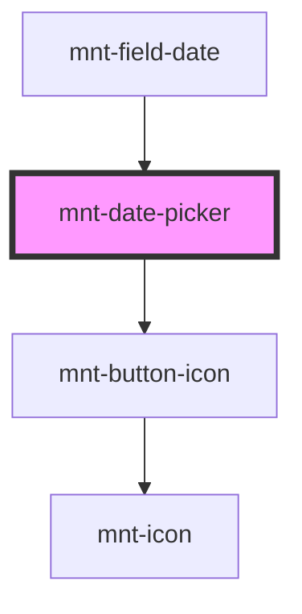

# mnt-date-picker

Componente de seleção de datas com suporte a modo single (data única) e range (intervalo de datas).

## Uso Básico

```html
<!-- Modo Single -->
<mnt-date-picker
  mode="single"
  (onDateSelected)="handleDateSelected($event)"
></mnt-date-picker>

<!-- Modo Range -->
<mnt-date-picker
  mode="range"
  (onDateSelected)="handleRangeSelected($event)"
></mnt-date-picker>
```

## Angular

```typescript
// Template
<mnt-date-picker
  [mode]="'single'"
  [selectedDate]="selectedDate"
  [minDate]="minDate"
  (onDateSelected)="handleDateSelected($event)"
  (onCancel)="handleCancel()"
></mnt-date-picker>

// Component
export class MyComponent {
  selectedDate: Date | null = null;
  minDate = new Date();

  handleDateSelected(event: any): void {
    console.log('Data selecionada:', event.detail.date);
    console.log('Formatada:', event.detail.formattedDate);
    this.selectedDate = event.detail.date;
  }

  handleCancel(): void {
    console.log('Seleção cancelada');
  }
}
```

## Eventos

- `onDateSelected`: Emitido quando uma data (ou range) é selecionada
- `onCancel`: Emitido quando o usuário cancela a seleção
- `onMonthChange`: Emitido quando o usuário navega entre meses

## Métodos Públicos

- `getSelectedDate()`: Retorna a data ou range selecionado
- `setSelectedDate(date)`: Define a data selecionada (modo single)
- `setSelectedRange(range)`: Define o range selecionado (modo range)
- `clearSelection()`: Limpa a seleção

## Props

| Prop | Tipo | Padrão | Descrição |
|------|------|--------|-----------|
| `mode` | `'single' \| 'range'` | `'single'` | Modo de seleção |
| `selectedDate` | `Date \| string` | `null` | Data selecionada (modo single) |
| `selectedRange` | `DateRange` | `null` | Range selecionado (modo range) |
| `minDate` | `Date \| string` | `null` | Data mínima selecionável |
| `maxDate` | `Date \| string` | `null` | Data máxima selecionável |
| `locale` | `string` | `'pt-BR'` | Locale para formatação |
| `disabled` | `boolean` | `false` | Se está desabilitado |
| `required` | `boolean` | `false` | Se é obrigatório |
| `disablePastDates` | `boolean` | `false` | Desabilita seleção de datas passadas |

## Exemplos Práticos

### Desabilitar Datas Passadas

```html
<!-- Ideal para agendamentos e reservas -->
<mnt-date-picker
  mode="single"
  disable-past-dates
  (onDateSelected)="handleDateSelected($event)"
></mnt-date-picker>
```

### Range com Data Mínima

```html
<!-- Período a partir de hoje -->
<mnt-date-picker
  mode="range"
  disable-past-dates
  (onDateSelected)="handleRangeSelected($event)"
></mnt-date-picker>
```

<!-- Auto Generated Below -->


## Properties

| Property           | Attribute            | Description | Type                  | Default     |
| ------------------ | -------------------- | ----------- | --------------------- | ----------- |
| `disablePastDates` | `disable-past-dates` |             | `boolean`             | `false`     |
| `disabled`         | `disabled`           |             | `boolean`             | `false`     |
| `firstDayOfWeek`   | `first-day-of-week`  |             | `number`              | `0`         |
| `initialMonth`     | `initial-month`      |             | `Date \| string`      | `null`      |
| `locale`           | `locale`             |             | `string`              | `'pt-BR'`   |
| `maxDate`          | `max-date`           |             | `Date \| string`      | `null`      |
| `minDate`          | `min-date`           |             | `Date \| string`      | `null`      |
| `mode`             | `mode`               |             | `"range" \| "single"` | `'single'`  |
| `placeholder`      | `placeholder`        |             | `string`              | `undefined` |
| `required`         | `required`           |             | `boolean`             | `false`     |
| `selectedDate`     | `selected-date`      |             | `Date \| string`      | `null`      |
| `selectedRange`    | --                   |             | `DateRange`           | `null`      |


## Events

| Event                   | Description | Type                                   |
| ----------------------- | ----------- | -------------------------------------- |
| `datePickerCancel`      |             | `CustomEvent<void>`                    |
| `datePickerMonthChange` |             | `CustomEvent<MonthYear>`               |
| `datePickerSelected`    |             | `CustomEvent<DateSelectedEventDetail>` |


## Dependencies

### Used by

 - [mnt-field-date](../field-date)

### Depends on

- [mnt-button-icon](../button)

### Graph


----------------------------------------------

*Built with [StencilJS](https://stenciljs.com/)*
