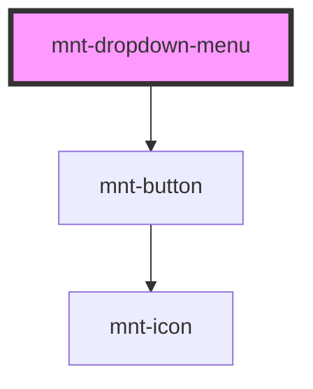

# mnt-dropdown-menu

<!-- Auto Generated Below -->

## Properties

| Property              | Attribute                | Description                                                                                       | Type                                                                                          | Default     |
| --------------------- | ------------------------ | ------------------------------------------------------------------------------------------------- | --------------------------------------------------------------------------------------------- | ----------- |
| `closeOnOutsideClick` | `close-on-outside-click` | When true, clicking anywhere outside the menu closes it. Default: true.                           | `boolean`                                                                                     | `true`      |
| `color`               | `color`                  | Button color variant.                                                                             | `"critical" \| "neutral" \| "primary" \| "secondary" \| "success" \| "tertiary" \| "warning"` | `'neutral'` |
| `disabled`            | `disabled`               | Disables the trigger button.                                                                      | `boolean`                                                                                     | `false`     |
| `fullWidth`           | `full-width`             | Makes the trigger button fill 100% of its container width.                                        | `boolean`                                                                                     | `false`     |
| `iconLeft`            | `icon-left`              | Icon on the left side of the button label.                                                        | `string`                                                                                      | `undefined` |
| `iconRight`           | `icon-right`             | Icon on the right side of the button label (defaults to caret-down when no iconLeft is provided). | `string`                                                                                      | `undefined` |
| `items`               | `items`                  | Items to display in the menu. Accepts a JSON string or a direct array.                            | `DropdownMenuRawItem[] \| string`                                                             | `'[]'`      |
| `label`               | `label`                  | Button label (passed to mnt-button).                                                              | `string`                                                                                      | `undefined` |
| `selectedValue`       | `selected-value`         | Value of the currently selected item. When set, that item shows a check icon.                     | `string`                                                                                      | `undefined` |
| `size`                | `size`                   | Button size.                                                                                      | `"large" \| "medium" \| "small" \| "tiny"`                                                    | `'medium'`  |
| `state`               | `state`                  | Button state.                                                                                     | `"default" \| "loading" \| "pressed"`                                                         | `'default'` |
| `variant`             | `variant`                | Button style variant.                                                                             | `"emphasis" \| "filter" \| "link" \| "plain" \| "regular" \| "stroke"`                        | `'stroke'`  |

## Events

| Event        | Description | Type                                     |
| ------------ | ----------- | ---------------------------------------- |
| `menuSelect` |             | `CustomEvent<DropdownMenuSelectPayload>` |

## Dependencies

### Depends on

- [mnt-button](../button)

### Graph

----------------------------------------------

*Built with [StencilJS](https://stenciljs.com/)*
