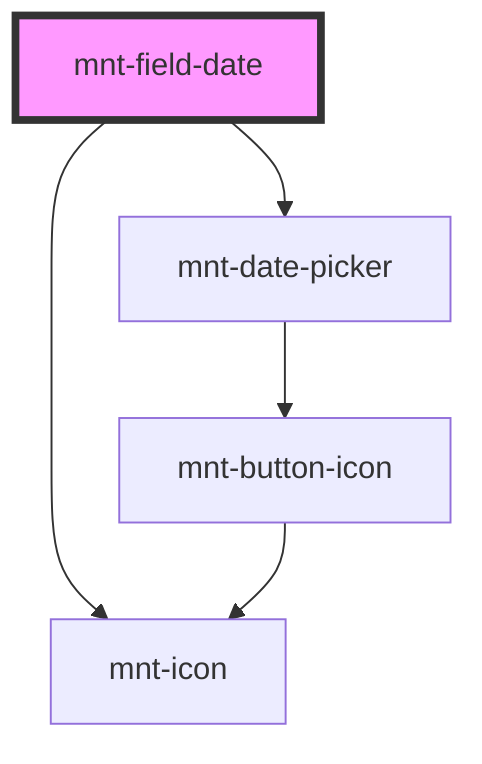

# mnt-field-date

<!-- Auto Generated Below -->

## Properties

| Property           | Attribute     | Description | Type                                       | Default     |
| ------------------ | ------------- | ----------- | ------------------------------------------ | ----------- |
| `datePickerConfig` | --            |             | `DatePickerBaseProps`                      | `undefined` |
| `disabled`         | `disabled`    |             | `boolean`                                  | `false`     |
| `inputName`        | `input-name`  |             | `string`                                   | `undefined` |
| `labelText`        | `label-text`  |             | `string`                                   | `undefined` |
| `placeholder`      | `placeholder` |             | `string`                                   | `undefined` |
| `required`         | `required`    |             | `boolean`                                  | `false`     |
| `size`             | `size`        |             | `"large" \| "medium" \| "small" \| "tiny"` | `'medium'`  |
| `value`            | `value`       |             | `string`                                   | `undefined` |

## Events

| Event            | Description                                                                    | Type                  |
| ---------------- | ------------------------------------------------------------------------------ | --------------------- |
| `rawValueChange` | Evento emitido com o valor numérico (sem formatação) quando o campo é alterado | `CustomEvent<string>` |
| `valueChange`    |                                                                                | `CustomEvent<string>` |

## Dependencies

### Depends on

- [mnt-icon](../icon)
- [mnt-date-picker](../date-picker)

### Graph

----------------------------------------------

*Built with [StencilJS](https://stenciljs.com/)*
