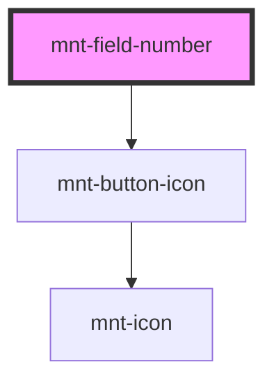

# mnt-field-number

<!-- Auto Generated Below -->

## Properties

| Property                 | Attribute    | Description | Type                   | Default     |
| ------------------------ | ------------ | ----------- | ---------------------- | ----------- |
| `inputName` _(required)_ | `input-name` |             | `string`               | `undefined` |
| `label`                  | `label`      |             | `string`               | `undefined` |
| `max`                    | `max`        |             | `number`               | `undefined` |
| `min`                    | `min`        |             | `number`               | `undefined` |
| `required`               | `required`   |             | `boolean`              | `false`     |
| `step`                   | `step`       |             | `number`               | `0.1`       |
| `toFixed`                | `to-fixed`   |             | `number`               | `undefined` |
| `value`                  | `value`      |             | `number \| string`     | `0`         |
| `variant`                | `variant`    |             | `"default" \| "plain"` | `'default'` |

## Events

| Event            | Description                                                                    | Type                  |
| ---------------- | ------------------------------------------------------------------------------ | --------------------- |
| `rawValueChange` | Evento emitido com o valor numérico (sem formatação) quando o campo é alterado | `CustomEvent<string>` |
| `valueChange`    |                                                                                | `CustomEvent<string>` |

## Dependencies

### Depends on

- [mnt-button-icon](../button)

### Graph

----------------------------------------------

*Built with [StencilJS](https://stenciljs.com/)*
