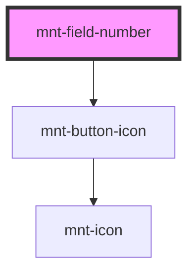

# mnt-field-number

<!-- Auto Generated Below -->

## Properties

| Property                 | Attribute    | Description | Type                               | Default     |
| ------------------------ | ------------ | ----------- | ---------------------------------- | ----------- |
| `disabled`               | `disabled`   |             | `boolean`                          | `undefined` |
| `inputName` _(required)_ | `input-name` |             | `string`                           | `undefined` |
| `label`                  | `label`      |             | `string`                           | `undefined` |
| `max`                    | `max`        |             | `number`                           | `undefined` |
| `min`                    | `min`        |             | `number`                           | `undefined` |
| `required`               | `required`   |             | `boolean`                          | `undefined` |
| `size`                   | `size`       |             | `"large" \| "medium" \| "small"`   | `undefined` |
| `step`                   | `step`       |             | `number`                           | `undefined` |
| `value`                  | `value`      |             | `string`                           | `'0'`       |
| `variant`                | `variant`    |             | `"default" \| "plain" \| "simple"` | `'plain'`   |

## Dependencies

### Depends on

- [mnt-button-icon](../button)

### Graph

----------------------------------------------

*Built with [StencilJS](https://stenciljs.com/)*
