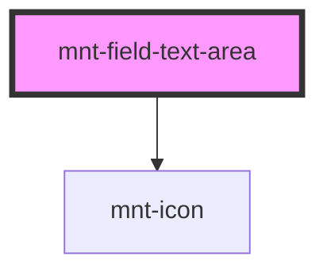

# mnt-field-text-area

<!-- Auto Generated Below -->

## Properties

| Property          | Attribute           | Description | Type                                | Default     |
| ----------------- | ------------------- | ----------- | ----------------------------------- | ----------- |
| `disabled`        | `disabled`          |             | `boolean`                           | `false`     |
| `hasActionButton` | `has-action-button` |             | `boolean`                           | `undefined` |
| `hasInfoButton`   | `has-info-button`   |             | `boolean`                           | `undefined` |
| `inlineMessage`   | `inline-message`    |             | `string`                            | `undefined` |
| `inputName`       | `input-name`        |             | `string`                            | `undefined` |
| `labelText`       | `label-text`        |             | `string`                            | `undefined` |
| `maxLength`       | `max-length`        |             | `number`                            | `300`       |
| `placeholder`     | `placeholder`       |             | `string`                            | `undefined` |
| `required`        | `required`          |             | `boolean`                           | `false`     |
| `rows`            | `rows`              |             | `number`                            | `5`         |
| `state`           | `state`             |             | `"default" \| "error" \| "success"` | `'default'` |
| `value`           | `value`             |             | `string`                            | `''`        |

## Events

| Event         | Description | Type                  |
| ------------- | ----------- | --------------------- |
| `valueChange` |             | `CustomEvent<string>` |

## Dependencies

### Depends on

- [mnt-icon](../icon)

### Graph

----------------------------------------------

*Built with [StencilJS](https://stenciljs.com/)*
