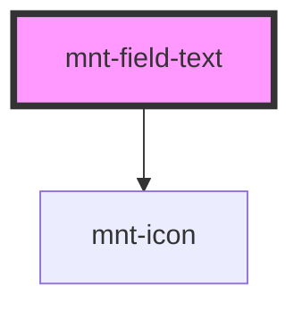

# mnt-field-text

<!-- Auto Generated Below -->

## Properties

| Property          | Attribute           | Description | Type                                       | Default     |
| ----------------- | ------------------- | ----------- | ------------------------------------------ | ----------- |
| `disabled`        | `disabled`          |             | `boolean`                                  | `false`     |
| `hasActionButton` | `has-action-button` |             | `boolean`                                  | `undefined` |
| `hasInfoButton`   | `has-info-button`   |             | `boolean`                                  | `undefined` |
| `iconLeft`        | `icon-left`         |             | `string`                                   | `undefined` |
| `iconRight`       | `icon-right`        |             | `string`                                   | `undefined` |
| `inlineMessage`   | `inline-message`    |             | `string`                                   | `undefined` |
| `inputName`       | `input-name`        |             | `string`                                   | `undefined` |
| `labelText`       | `label-text`        |             | `string`                                   | `undefined` |
| `mask`            | `mask`              |             | `"currency" \| "custom"`                   | `undefined` |
| `max`             | `max`               |             | `number`                                   | `undefined` |
| `maxLength`       | `max-length`        |             | `number`                                   | `undefined` |
| `min`             | `min`               |             | `number`                                   | `undefined` |
| `minLength`       | `min-length`        |             | `number`                                   | `undefined` |
| `placeholder`     | `placeholder`       |             | `string`                                   | `undefined` |
| `required`        | `required`          |             | `boolean`                                  | `false`     |
| `size`            | `size`              |             | `"large" \| "medium" \| "small" \| "tiny"` | `'medium'`  |
| `state`           | `state`             |             | `"default" \| "error" \| "success"`        | `'default'` |
| `value`           | `value`             |             | `string`                                   | `undefined` |

## Events

| Event            | Description                                                                    | Type                  |
| ---------------- | ------------------------------------------------------------------------------ | --------------------- |
| `rawValueChange` | Evento emitido com o valor numérico (sem formatação) quando o campo é alterado | `CustomEvent<string>` |
| `valueChange`    |                                                                                | `CustomEvent<string>` |

## Dependencies

### Depends on

- [mnt-icon](../icon)

### Graph

----------------------------------------------

*Built with [StencilJS](https://stenciljs.com/)*
