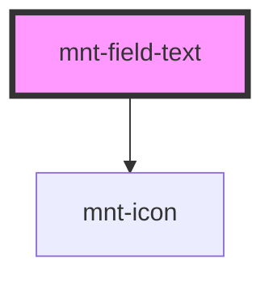

# mnt-field-text

<!-- Auto Generated Below -->

## Properties

| Property          | Attribute           | Description | Type                                       | Default     |
| ----------------- | ------------------- | ----------- | ------------------------------------------ | ----------- |
| `customMask`      | --                  |             | `(value: string) => string`                | `undefined` |
| `fullWidth`       | `full-width`        |             | `boolean`                                  | `false`     |
| `hasActionButton` | `has-action-button` |             | `boolean`                                  | `undefined` |
| `hasInfoButton`   | `has-info-button`   |             | `boolean`                                  | `undefined` |
| `iconLeft`        | `icon-left`         |             | `string`                                   | `undefined` |
| `iconRight`       | `icon-right`        |             | `string`                                   | `undefined` |
| `inlineMessage`   | `inline-message`    |             | `string`                                   | `undefined` |
| `labelText`       | `label-text`        |             | `string`                                   | `undefined` |
| `mask`            | `mask`              |             | `"currency" \| "custom"`                   | `undefined` |
| `name`            | `name`              |             | `string`                                   | `undefined` |
| `placeholder`     | `placeholder`       |             | `string`                                   | `undefined` |
| `size`            | `size`              |             | `"large" \| "medium" \| "small" \| "tiny"` | `'medium'`  |
| `state`           | `state`             |             | `"default" \| "error" \| "success"`        | `'default'` |
| `value`           | `value`             |             | `string`                                   | `undefined` |

## Events

| Event         | Description | Type                                                          |
| ------------- | ----------- | ------------------------------------------------------------- |
| `valueChange` |             | `CustomEvent<{ formattedValue: string; rawValue?: string; }>` |

## Dependencies

### Depends on

- [mnt-icon](../icon)

### Graph

----------------------------------------------

*Built with [StencilJS](https://stenciljs.com/)*
