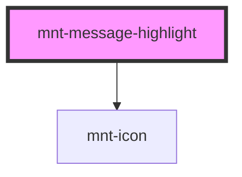

# mnt-message-inline

<!-- Auto Generated Below -->

## Properties

| Property       | Attribute       | Description | Type                                                                            | Default     |
| -------------- | --------------- | ----------- | ------------------------------------------------------------------------------- | ----------- |
| `fullWidth`    | `full-width`    |             | `boolean`                                                                       | `false`     |
| `icon`         | `icon`          |             | `string`                                                                        | `''`        |
| `label`        | `label`         |             | `string`                                                                        | `''`        |
| `marginBottom` | `margin-bottom` |             | `boolean`                                                                       | `false`     |
| `type`         | `type`          |             | `"default" \| "emphasis"`                                                       | `'default'` |
| `variant`      | `variant`       |             | `"critical" \| "neutral" \| "primary" \| "secondary" \| "success" \| "warning"` | `'neutral'` |

## Dependencies

### Depends on

- [mnt-icon](../icon)

### Graph

----------------------------------------------

*Built with [StencilJS](https://stenciljs.com/)*
