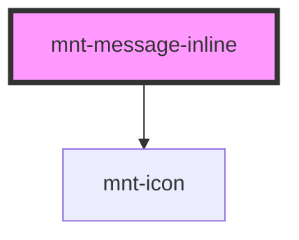

# mnt-message-inline

<!-- Auto Generated Below -->

## Properties

| Property     | Attribute     | Description | Type                                | Default     |
| ------------ | ------------- | ----------- | ----------------------------------- | ----------- |
| `hasPadding` | `has-padding` |             | `boolean`                           | `false`     |
| `icon`       | `icon`        |             | `string`                            | `undefined` |
| `label`      | `label`       |             | `string`                            | `''`        |
| `variant`    | `variant`     |             | `"error" \| "neutral" \| "success"` | `'neutral'` |

## Dependencies

### Depends on

- [mnt-icon](../icon)

### Graph

----------------------------------------------

*Built with [StencilJS](https://stenciljs.com/)*
