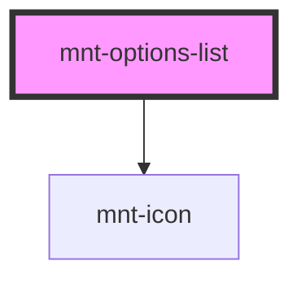

# mnt-field-text

<!-- Auto Generated Below -->

## Properties

| Property      | Attribute     | Description | Type      | Default     |
| ------------- | ------------- | ----------- | --------- | ----------- |
| `fullWidth`   | `full-width`  |             | `boolean` | `false`     |
| `items`       | `items`       |             | `string`  | `'[]'`      |
| `name`        | `name`        |             | `string`  | `undefined` |
| `placeholder` | `placeholder` |             | `string`  | `undefined` |
| `value`       | `value`       |             | `string`  | `undefined` |

## Events

| Event          | Description | Type                                   |
| -------------- | ----------- | -------------------------------------- |
| `optionSelect` |             | `CustomEvent<OptionsListChangeDetail>` |

## Dependencies

### Depends on

- [mnt-icon](../icon)

### Graph

----------------------------------------------

*Built with [StencilJS](https://stenciljs.com/)*
