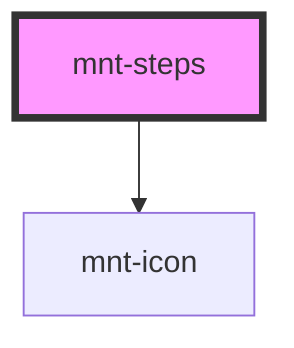

# mnt-steps

<!-- Auto Generated Below -->

## Properties

| Property       | Attribute        | Description | Type                         | Default        |
| -------------- | ---------------- | ----------- | ---------------------------- | -------------- |
| `activeStepId` | `active-step-id` |             | `string`                     | `undefined`    |
| `orientation`  | `orientation`    |             | `"horizontal" \| "vertical"` | `'horizontal'` |
| `steps`        | --               |             | `StepItem[]`                 | `[]`           |

## Events

| Event       | Description | Type                                                                                                            |
| ----------- | ----------- | --------------------------------------------------------------------------------------------------------------- |
| `stepClick` |             | `CustomEvent<{ stepId: string; stepIndex: number; status: "disabled" \| "done" \| "active"; step: StepItem; }>` |

## Dependencies

### Depends on

- [mnt-icon](../icon)

### Graph

----------------------------------------------

*Built with [StencilJS](https://stenciljs.com/)*
