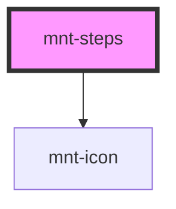

# mnt-steps

O componente `mnt-steps` é utilizado para indicar o progresso de um processo em múltiplas etapas. Ele pode ser exibido em orientação horizontal ou vertical, e cada etapa pode ter um dos três estados: completado, ativo ou desabilitado.

## Uso

```html
<mnt-steps
  orientation="horizontal"
  steps='[
    {"label": "Step 1", "status": "completed"},
    {"label": "Step 2", "status": "completed"},
    {"label": "Step 3", "status": "active"},
    {"label": "Step 4", "status": "disabled"}
  ]'
></mnt-steps>
```

## Propriedades

| Propriedade   | Tipo                          | Padrão         | Descrição                                                  |
| ------------- | ----------------------------- | -------------- | ---------------------------------------------------------- |
| `orientation` | `'horizontal' \| 'vertical'`  | `'horizontal'` | Define a orientação do componente                          |
| `steps`       | `StepItem[]`                  | `[]`           | Array de steps com label e status                          |

### StepItem

```typescript
interface StepItem {
  label: string;
  status: 'completed' | 'active' | 'disabled';
  icon?: number | ExtendedIconName; // Opcional: número ou ícone customizado
}
```

| Propriedade | Tipo                          | Obrigatório | Descrição                                    |
| ----------- | ----------------------------- | ----------- | -------------------------------------------- |
| `label`     | `string`                      | Sim         | Texto exibido ao lado do step                |
| `status`    | `StepStatus`                  | Sim         | Estado do step (completed/active/disabled)   |
| `icon`      | `number \| ExtendedIconName`  | Não         | Número ou ícone customizado para o círculo   |

## Estados

### Completed (Completado)
- Background azul claro (#83cef6)
- Ícone de check branco
- Indica que a etapa foi concluída

### Active (Ativo)
- Background azul muito claro (#e1f1fd)
- Borda azul (#0b7cbe)
- Ícone placeholder azul
- Indica a etapa atual

### Disabled (Desabilitado)
- Background cinza (#f5f6f6)
- Ícone placeholder cinza
- Indica etapas futuras ainda não disponíveis

## Exemplos

### Horizontal
```html
<mnt-steps
  orientation="horizontal"
  steps='[
    {"label": "Dados Pessoais", "status": "completed"},
    {"label": "Endereço", "status": "completed"},
    {"label": "Pagamento", "status": "active"},
    {"label": "Confirmação", "status": "disabled"}
  ]'
></mnt-steps>
```

### Vertical
```html
<mnt-steps
  orientation="vertical"
  steps='[
    {"label": "Criar Conta", "status": "completed"},
    {"label": "Verificar Email", "status": "completed"},
    {"label": "Configurar Perfil", "status": "active"},
    {"label": "Começar a Usar", "status": "disabled"}
  ]'
></mnt-steps>
```

### Com Números
```html
<mnt-steps
  orientation="horizontal"
  steps='[
    {"label": "Passo 1", "status": "completed", "icon": 1},
    {"label": "Passo 2", "status": "active", "icon": 2},
    {"label": "Passo 3", "status": "disabled", "icon": 3}
  ]'
></mnt-steps>
```

### Com Ícones Customizados
```html
<mnt-steps
  orientation="horizontal"
  steps='[
    {"label": "Usuário", "status": "completed", "icon": "userCircle"},
    {"label": "Endereço", "status": "completed", "icon": "houseSimple"},
    {"label": "Pagamento", "status": "active", "icon": "currencyDollarCircle"},
    {"label": "Confirmação", "status": "disabled", "icon": "checkCircle"}
  ]'
></mnt-steps>
```

<!-- Auto Generated Below -->


## Properties

| Property      | Attribute     | Description | Type                         | Default        |
| ------------- | ------------- | ----------- | ---------------------------- | -------------- |
| `orientation` | `orientation` |             | `"horizontal" \| "vertical"` | `'horizontal'` |
| `steps`       | --            |             | `StepItem[]`                 | `[]`           |


## Dependencies

### Depends on

- [mnt-icon](../icon)

### Graph


----------------------------------------------

*Built with [StencilJS](https://stenciljs.com/)*
