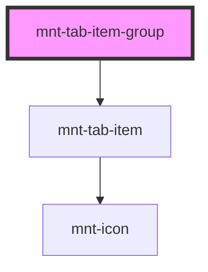

# mnt-tab-item-group

<!-- Auto Generated Below -->

## Properties

| Property            | Attribute     | Description | Type                         | Default        |
| ------------------- | ------------- | ----------- | ---------------------------- | -------------- |
| `orientation`       | `orientation` |             | `"horizontal" \| "vertical"` | `'horizontal'` |
| `selectedId`        | `selected-id` |             | `string`                     | `undefined`    |
| `tabs` _(required)_ | `tabs`        |             | `TabItem[] \| string`        | `undefined`    |

## Events

| Event       | Description | Type                  |
| ----------- | ----------- | --------------------- |
| `tabChange` |             | `CustomEvent<string>` |

## Shadow Parts

| Part          | Description |
| ------------- | ----------- |
| `"tab-group"` |             |

## Dependencies

### Depends on

- [mnt-tab-item](../tab-item)

### Graph

----------------------------------------------

*Built with [StencilJS](https://stenciljs.com/)*
