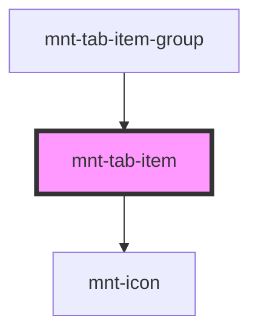

# mnt-tab-item

<!-- Auto Generated Below -->

## Properties

| Property             | Attribute     | Description | Type                         | Default        |
| -------------------- | ------------- | ----------- | ---------------------------- | -------------- |
| `disabled`           | `disabled`    |             | `boolean`                    | `false`        |
| `icon`               | `icon`        |             | `string`                     | `undefined`    |
| `label` _(required)_ | `label`       |             | `string`                     | `undefined`    |
| `orientation`        | `orientation` |             | `"horizontal" \| "vertical"` | `'horizontal'` |
| `selected`           | `selected`    |             | `boolean`                    | `false`        |
| `tabId` _(required)_ | `tab-id`      |             | `string`                     | `undefined`    |

## Events

| Event          | Description | Type                  |
| -------------- | ----------- | --------------------- |
| `tabItemClick` |             | `CustomEvent<string>` |

## Shadow Parts

| Part         | Description |
| ------------ | ----------- |
| `"tab-item"` |             |

## Dependencies

### Used by

 - [mnt-tab-item-group](../tab-item-group)

### Depends on

- [mnt-icon](../icon)

### Graph

----------------------------------------------

*Built with [StencilJS](https://stenciljs.com/)*
