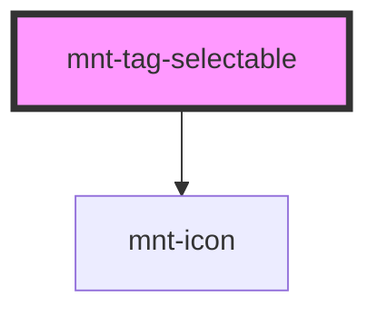

# mnt-tag-selectable

<!-- Auto Generated Below -->

## Properties

| Property | Attribute | Description | Type                                       | Default     |
| -------- | --------- | ----------- | ------------------------------------------ | ----------- |
| `icon`   | `icon`    |             | `string`                                   | `undefined` |
| `label`  | `label`   |             | `string`                                   | `undefined` |
| `size`   | `size`    |             | `"large" \| "medium" \| "small" \| "tiny"` | `'medium'`  |

## Events

| Event                 | Description | Type                                  |
| --------------------- | ----------- | ------------------------------------- |
| `tagSelectableChange` |             | `CustomEvent<{ selected: boolean; }>` |

## Dependencies

### Depends on

- [mnt-icon](../icon)

### Graph

----------------------------------------------

*Built with [StencilJS](https://stenciljs.com/)*
