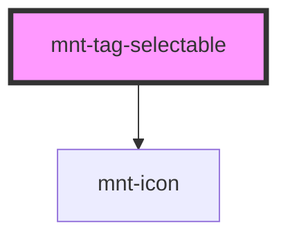

# mnt-tag-selectable

<!-- Auto Generated Below -->

## Properties

| Property             | Attribute | Description | Type                                       | Default     |
| -------------------- | --------- | ----------- | ------------------------------------------ | ----------- |
| `icon`               | `icon`    |             | `string`                                   | `undefined` |
| `label` _(required)_ | `label`   |             | `string`                                   | `undefined` |
| `size`               | `size`    |             | `"large" \| "medium" \| "small" \| "tiny"` | `'medium'`  |
| `tagId`              | `tag-id`  |             | `string`                                   | `undefined` |

## Events

| Event         | Description | Type                                             |
| ------------- | ----------- | ------------------------------------------------ |
| `tagSelected` |             | `CustomEvent<{ tagId: string; label: string; }>` |

## Shadow Parts

| Part       | Description |
| ---------- | ----------- |
| `"button"` |             |

## Dependencies

### Depends on

- [mnt-icon](../icon)

### Graph

----------------------------------------------

*Built with [StencilJS](https://stenciljs.com/)*
