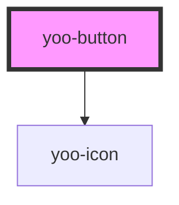

# yoo-button

<!-- Auto Generated Below -->

## Properties

| Property        | Attribute        | Description | Type                                                                                          | Default     |
| --------------- | ---------------- | ----------- | --------------------------------------------------------------------------------------------- | ----------- |
| `color`         | `color`          |             | `"critical" \| "neutral" \| "primary" \| "secondary" \| "success" \| "tertiary" \| "warning"` | `'primary'` |
| `disabled`      | `disabled`       |             | `boolean`                                                                                     | `false`     |
| `fullWidth`     | `full-width`     |             | `boolean`                                                                                     | `false`     |
| `iconAnimation` | `icon-animation` |             | `any`                                                                                         | `undefined` |
| `iconLeft`      | `icon-left`      |             | `string`                                                                                      | `undefined` |
| `iconRight`     | `icon-right`     |             | `string`                                                                                      | `undefined` |
| `label`         | `label`          |             | `string`                                                                                      | `undefined` |
| `size`          | `size`           |             | `"large" \| "medium" \| "small"`                                                              | `'medium'`  |
| `variant`       | `variant`        |             | `"emphasis" \| "plain" \| "regular" \| "stroke"`                                              | `'regular'` |

## Shadow Parts

| Part       | Description |
| ---------- | ----------- |
| `"button"` |             |

## Dependencies

### Depends on

- [yoo-icon](../yoo-icon)

### Graph

----------------------------------------------

*Built with [StencilJS](https://stenciljs.com/)*
