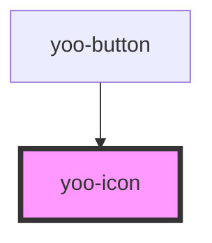

# yoo-icon

<!-- Auto Generated Below -->

## Properties

| Property            | Attribute    | Description | Type                                                        | Default          |
| ------------------- | ------------ | ----------- | ----------------------------------------------------------- | ---------------- |
| `animation`         | `animation`  |             | `"rotation"`                                                | `undefined`      |
| `background`        | `background` |             | `string`                                                    | `undefined`      |
| `color`             | `color`      |             | `string`                                                    | `'currentColor'` |
| `icon` _(required)_ | `icon`       |             | `string`                                                    | `undefined`      |
| `size`              | `size`       |             | `"doubleLarge" \| "large" \| "medium" \| "small" \| number` | `'medium'`       |

## Dependencies

### Used by

 - [yoo-button](../yoo-button)

### Graph

----------------------------------------------

*Built with [StencilJS](https://stenciljs.com/)*
